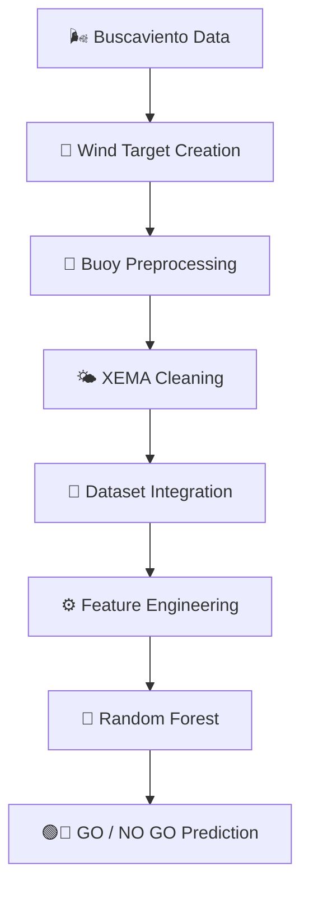

# 🌊 GO / NO GO
## Intelligent Sea Breeze Prediction System for Water Sports Using Machine Learning


---

## 🎯 Project Overview

GO / NO GO is a Machine Learning project designed to predict the occurrence of **Sea Breeze (thermal wind) events** in Badalona, Spain.

The objective is to help water sports enthusiasts make better travel decisions by identifying days with a high probability of favorable wind conditions.

Traditional weather forecasts often struggle to capture local thermal wind phenomena. This project combines meteorological, oceanographic and historical wind observations to create a data-driven decision support system.

---

## 🚀 Business Problem

Many riders travel long distances expecting favorable wind conditions, only to discover that the forecast was inaccurate.

This creates:

❌ Unnecessary travel costs

❌ Lost time

❌ Missed opportunities

❌ Reduced confidence in forecasts

The goal of this project is to answer a simple question:

> **Will there be a good thermal wind session today?**

The final output is:

🟢 **GO** → Conditions are favorable

🔴 **NO GO** → Conditions are unlikely to be favorable

---

## 🎯 Project Objectives

### Main Objective

Develop a Machine Learning model capable of predicting Sea Breeze events using atmospheric and oceanographic conditions.

### Specific Objectives

✅ Identify the main drivers of Sea Breeze formation

✅ Validate meteorological hypotheses using historical data

✅ Build an interpretable Machine Learning model

✅ Evaluate predictive performance on unseen future data

✅ Create the foundation for an operational forecasting system

---

# 📊 Data Sources

The project integrates three independent real-world datasets covering the period **2010–2025**.

## 🌬️ 1. Buscaviento Badalona

Wind observations from the local windsurf spot.

**Variables**

- Wind speed
- Wind gust
- Wind direction

**Frequency**

📍 Every 15 minutes

---

## 🌤️ 2. XEMA (Meteocat)

Meteorological observations from Museu de Badalona.

**Variables**

- Air temperature
- Solar irradiance
- Atmospheric pressure
- Relative humidity
- Precipitation

**Frequency**

📍 Hourly

---

## 🌊 3. Barcelona Oceanographic Buoy

Data provided by Puertos del Estado.

**Variables**

- Sea Surface Temperature (SST)
- Wave parameters

**Frequency**

📍 Hourly

---

# 📈 Dataset Statistics

| Metric | Value |
|----------|----------|
| Study period | 2010–2025 |
| Raw observations | > 4 Million |
| Final daily records | 5,806 |
| Data Sources | 3 |
| Features Used | 9 |

---

# 🔄 Project Pipeline



---

# 🧠 Feature Engineering

Several physically meaningful variables were created:

🌡️ Air-Sea Thermal Gradient

🌙 Night-Day Temperature Gradient

☀️ Daily Solar Irradiance Maximum

🌊 Sea Surface Temperature

📈 Atmospheric Pressure

📅 Seasonal Indicators

📆 Day of Year

📆 Month

The objective was to represent the atmospheric mechanisms responsible for thermal wind generation.

---

# 🔬 Research Hypothesis

The project is based on three meteorological assumptions:

### H1 ☀️

Higher solar irradiance increases the probability of Sea Breeze formation.

### H2 🌡️

A larger air-sea thermal contrast increases thermal wind intensity.

### H3 🌙

Greater day-night temperature differences increase the likelihood of Sea Breeze events.

✅ The exploratory analysis confirmed all three hypotheses.

---

# 🤖 Machine Learning Model

## Algorithm

🌲 Random Forest Classifier

### Configuration

- 500 Decision Trees
- Maximum Depth = 12
- Class Weight Balancing
- Temporal Split Strategy

### Why Random Forest?

✅ Handles non-linear relationships

✅ Robust against noise

✅ Interpretable feature importance

✅ Strong baseline performance

---

# ⏳ Train / Test / Validation Strategy

| Dataset | Period |
|----------|----------|
| Train | 2010–2021 |
| Test | 2022–2023 |
| Validation | 2024–2025 |

---

# 📊 Model Performance

## Test Dataset

| Metric | Score |
|----------|----------|
| Accuracy | 0.648 |
| Precision | 0.447 |
| Recall | 0.616 |
| F1 Score | 0.518 |
| ROC-AUC | 0.714 |

---

## Validation Dataset

| Metric | Score |
|----------|----------|
| F1 Score | 0.470 |
| ROC-AUC | 0.701 |

---

# 🏆 Most Important Features

| Rank | Feature | Importance |
|--------|------------|------------|
| 1 | Solar Irradiance Max | 23.1% |
| 2 | Air-Sea Gradient | 16.5% |
| 3 | Night-Day Gradient | 15.0% |
| 4 | Day of Year | 13.6% |
| 5 | Pressure Mean | 12.0% |
| 6 | SST Mean | 11.7% |

---

# 🔍 Key Findings

### 🌊 Sea Breeze is not random

Historical analysis demonstrates that Sea Breeze events follow identifiable atmospheric patterns.

### 🌡️ Thermal gradients matter

Land-sea thermal contrast is one of the strongest predictors.

### 🤖 Machine Learning captures physical processes

The model successfully learned relationships that align with known meteorological mechanisms.

### 🚀 Operational potential

The project demonstrates that a GO / NO GO decision-support tool is feasible.

---

# ⚠️ Current Limitations

- Uses same-day variables
- Not yet a true forecasting system
- No NWP weather models
- No real-time deployment

---

# 🛣️ Future Development

- Open-Meteo integration
- GFS integration
- Daily forecast generation
- Web dashboard
- Mobile App
- Real-time predictions

---

# 🛠️ Technologies Used


---

# 📂 Repository Structure

```text
01_Wind_Target_Dataset_Badalona.ipynb
02_Buoy_Data_Preprocessing.ipynb
03_xema_ingestion_cleaning.ipynb
04_XEMA_Model_Ready_Dataset.ipynb
05_Data_Integration.ipynb
06_Feature_Engineering.ipynb
08_Daily_Thermal_Wind_Model.ipynb
```

---

# 👨‍💻 Author

**Roger Defez**

📊 Data Analyst

🎓 Data Analyst Bootcamp 2026

📍 Barcelona, Spain

---

# 💭 Final Thought

> *"The best session is not the one that happens.*
>
> *It is the one you know is going to happen."*